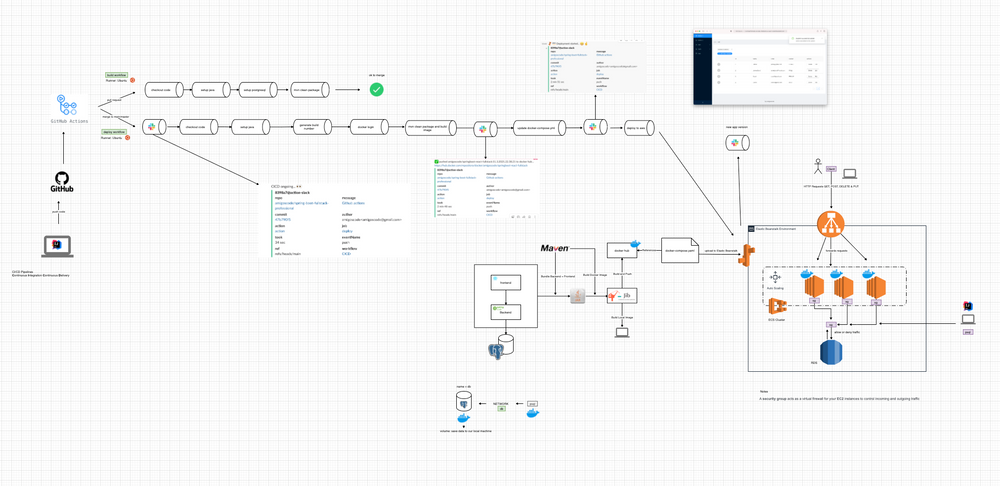

[![Contributors][contributors-shield]][contributors-url]
[![Issues][issues-shield]][issues-url]

# Springboot-react-fullstack

This system has CRUD operation for students.
Code made by AmigosCode course (https://amigoscode.com/courses/full-stack-spring-boot-react)
 

### Technologies

This section should list any major frameworks used to built the project.
* Spring boot
* React
* JPA & Hibernate
* Spring Validation
* Postgresql
* Docker and Jib
* AWS - Elastic Beanstalk
* CI CD with Github Actions
* Testing with JUnit5 and Assertions

### Architecture

    

### Publication

http://springbootreactfullstack-env.eba-6imc2iky.us-east-2.elasticbeanstalk.com

<!-- MARKDOWN LINKS & IMAGES -->
<!-- https://www.markdownguide.org/basic-syntax/#reference-style-links -->
[contributors-shield]: https://img.shields.io/github/contributors/johnsales/spring-boot-fullstack-react.svg?style=for-the-badge
[contributors-url]: https://github.com/johnsales/spring-boot-fullstack-react/graphs/contributors
[issues-shield]: https://img.shields.io/github/issues/johnsales/spring-boot-fullstack-react.svg?style=for-the-badge
[issues-url]: https://github.com/johnsales/spring-boot-fullstack-react/issues
